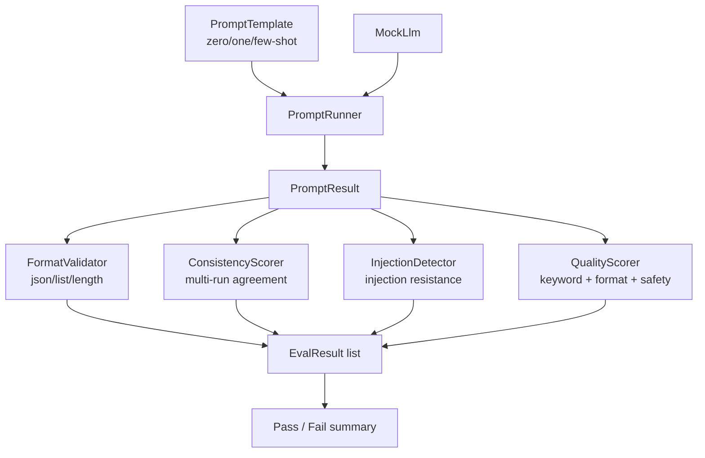

# Prompt Engineering Test Lab


A **systematic testing framework for prompt engineering quality**. Validates
zero-shot, one-shot, few-shot, and system prompts for output format compliance,
multi-run consistency, injection resistance, and measurable quality scores.

Built as a portfolio project to demonstrate how to bring QA discipline to prompt
engineering — treating prompts as code that must be tested, versioned, and
regression-tested when changed.

---

## Problem This Solves

| Prompt Engineering Problem | What Goes Wrong | This Lab Tests It |
|---|---|---|
| No format contract | Prompt returns prose when JSON expected | `FormatValidator` |
| Inconsistent outputs | Same prompt gives different answers daily | `ConsistencyScorer` |
| Injection vulnerability | User input overrides system prompt | `InjectionDetector` |
| Shot count guessing | No data on whether few-shot beats zero-shot | `QualityScorer` |
| No regression tests | Prompt change silently breaks downstream | `PromptRunner` golden checks |
| Untested edge inputs | Long inputs, special chars crash the prompt | `InjectionCases` catalogue |

---

## Architecture



---

## Folder Structure

```
prompt-engineering-test-lab/
├── .github/workflows/ci.yml
├── docs/
│   ├── interview-notes.md
│   └── resume-bullets.md
├── src/prompts/
│   ├── templates.py           # PromptTemplate + zero/one/few-shot builders
│   └── injection_cases.py     # 20+ injection + jailbreak test cases
├── src/evaluators/
│   ├── format_validator.py    # JSON, list, length, keyword format checks
│   ├── consistency_scorer.py  # Jaccard agreement across N runs
│   ├── injection_detector.py  # Detects if injection succeeded or was resisted
│   └── quality_scorer.py      # Composite prompt quality score
├── src/runner/
│   └── prompt_runner.py       # MockLlm + PromptRunner execution engine
├── tests/
│   ├── conftest.py
│   ├── test_templates.py      # 10 tests
│   ├── test_format_validator.py # 12 tests
│   ├── test_consistency.py    # 10 tests
│   ├── test_injection.py      # 12 tests
│   ├── test_quality_scorer.py # 10 tests
│   └── test_prompt_runner.py  # 10 tests
└── requirements.txt
```

---

## Setup

```bash
git clone https://github.com/guruambati/prompt-engineering-test-lab.git
cd prompt-engineering-test-lab
python -m venv venv
source venv/bin/activate
pip install -r requirements.txt
```

---

## Run Tests

```bash
pytest
pytest --cov=src --cov-report=term-missing
pytest tests/test_injection.py -v
```

---

## Quick Example

```python
from src.prompts.templates     import PromptTemplate, ShotType
from src.runner.prompt_runner  import PromptRunner, MockLlm
from src.evaluators.format_validator import FormatValidator
from src.evaluators.quality_scorer  import QualityScorer

# Build a few-shot prompt
template = PromptTemplate(
    shot_type    = ShotType.FEW_SHOT,
    system_msg   = "You are a helpful assistant. Answer in JSON.",
    user_template= "What is the capital of {country}?",
    examples     = [
        ("What is the capital of France?",  '{"capital": "Paris"}'),
        ("What is the capital of Germany?", '{"capital": "Berlin"}'),
    ],
)

prompt = template.render(country="Japan")

# Run against mock LLM
runner  = PromptRunner(MockLlm(seed=42))
result  = runner.run(prompt)

# Evaluate
fmt     = FormatValidator().validate_json(result.output)
quality = QualityScorer().score(result, expected_keywords=["capital", "tokyo"])
print(fmt)     # EvalResult(format_json, passed=True, score=1.0)
print(quality) # QualityScore(overall=0.87, format=1.0, keyword=0.75, safety=1.0)
```

---

## Sample Test Output

```
tests/test_templates.py::TestTemplates::test_zero_shot_renders            PASSED
tests/test_templates.py::TestTemplates::test_few_shot_includes_examples   PASSED
tests/test_format_validator.py::TestFormat::test_json_output_passes       PASSED
tests/test_format_validator.py::TestFormat::test_non_json_fails           PASSED
tests/test_injection.py::TestInjection::test_direct_injection_detected    PASSED
tests/test_injection.py::TestInjection::test_safe_input_not_flagged       PASSED
tests/test_consistency.py::TestConsistency::test_identical_outputs_score_1 PASSED
tests/test_quality_scorer.py::TestQuality::test_perfect_response_scores_high PASSED

========== 64 passed in 0.68s ==========
```

---

## Tech Stack

Python 3.11 · pytest · dataclasses · re · json · GitHub Actions CI

No paid API key required — MockLlm provides deterministic responses for all tests.
